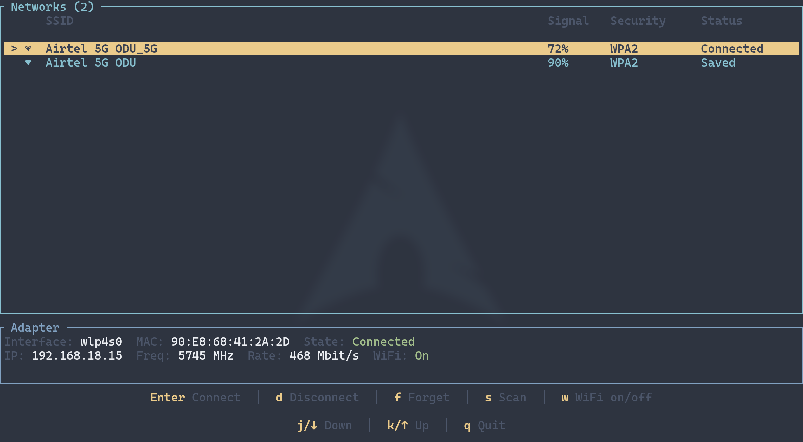

# wifitui

A terminal user interface for managing WiFi connections on Linux, built with Rust.



## Features

- Browse and connect to available WiFi networks
- Signal strength indicators with Nerd Font icons
- Password entry with show/hide toggle
- Disconnect from or forget saved networks
- Toggle WiFi on/off
- Adapter info panel (interface, MAC, IP, frequency, bitrate)
- Auto-scan and auto-refresh in the background
- Vim-style keybindings
- Toast notifications for connection events
- Configurable via TOML

## Requirements

- Linux with [NetworkManager](https://networkmanager.dev/) running
- A [Nerd Font](https://www.nerdfonts.com/) for signal strength icons

## Installation

### From crates.io

```bash
cargo install wifitui
```

### From source

```bash
git clone https://github.com/elameendaiyabu/wifitui.git
cd wifitui
cargo build --release
```

## Usage

```bash
wifitui
```

With a custom config file:

```bash
wifitui --config /path/to/config.toml
```

## Keybindings

| Key | Action |
|---|---|
| `j` / `Down` | Move down |
| `k` / `Up` | Move up |
| `g` | Jump to first |
| `G` | Jump to last |
| `Enter` / `Space` | Connect to selected network |
| `d` | Disconnect |
| `f` | Forget saved network |
| `s` | Scan for networks |
| `w` | Toggle WiFi on/off |
| `r` | Refresh |
| `q` / `Ctrl+c` | Quit |

### Password modal

| Key | Action |
|---|---|
| `Enter` | Submit password |
| `Esc` | Cancel |
| `Tab` | Toggle password visibility |
| `Ctrl+u` | Clear input |

## Configuration

wifitui looks for a config file at `~/.config/wifitui/config.toml`. You can override this with `--config`.

```toml
[general]
tick_rate = 250              # UI tick rate in ms
auto_scan_interval = 30      # Auto-scan interval in seconds
auto_refresh_interval = 10   # Auto-refresh interval in seconds
```

All values are optional and fall back to the defaults shown above.

## License

[GPL-3.0](LICENSE)
